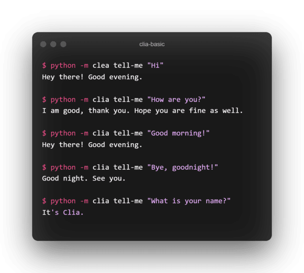
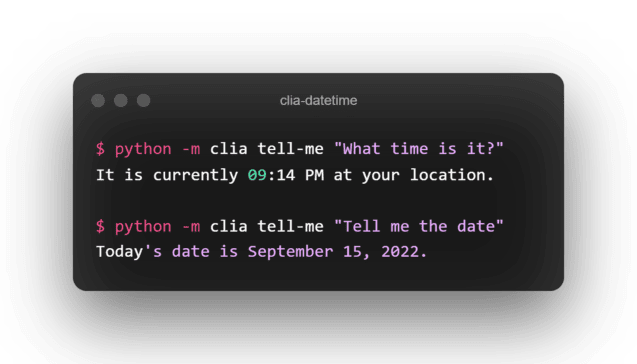
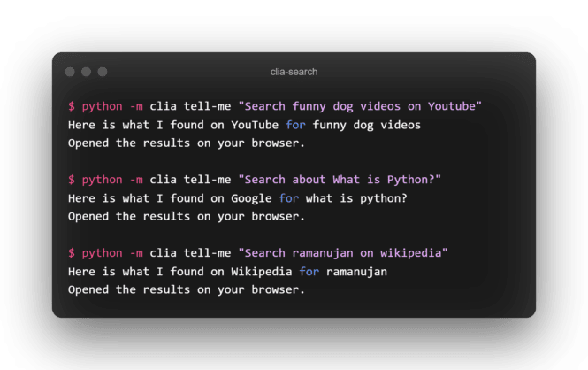
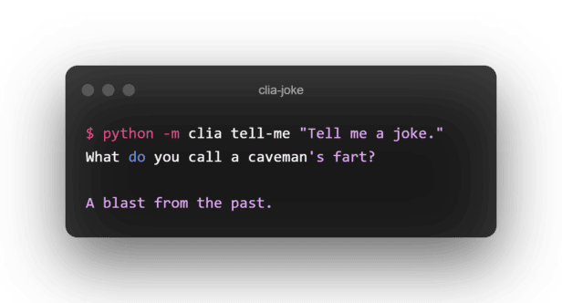

A Command Line Intelligent Assistant (CLIA, pronounced as _clea_) build using Python.

# Installation
```bash
pip install cia
```

# How to run
```bash
python -m clia tell-me "YOUR QUERY HERE"
```

# Note
- The query is matched using regular expressions, so there is no limitation on the order of the words in your query.
- Even though in the examples below, the output is just single-colored, the actual response in your terminal will be colored and highlighted based on the query 

# Example commands

## Some Basic greetings and closings like
```bash
python -m clia tell-me "Hi."
python -m clia tell-me "How are you?"
python -m clia tell-me "Good morning!"
python -m clia tell-me "Bye, goodnight!"
python -m clia tell-me "What is your name?"
```


## Ask date and time
```bash
python -m clia tell-me "What time is it?"
python -m clia tell-me "Tell me the date"
```


## Ask to search on web
``` bash
python -m clia tell-me "Search funny dog videos on Youtube"
python -m clia tell-me "Search about What is Python?"
python -m clia tell-me "Search ramanujan on wikipedia"
```


## Lighten up your mood
``` bash
python -m clia tell-me "Tell me a joke"
```

